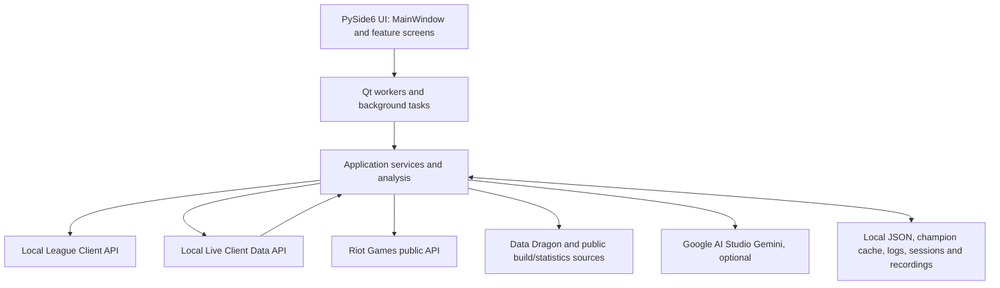

# SOLRALOL

<p align="center">
  
</p>

**A Windows desktop companion for League of Legends, built with Python and PySide6.** SOLRALOL brings together champion and draft analysis, local profile analytics, live match information, recommendations, saved match review, and optional gameplay recording.

> **Language:** SOLRALOL's interface is currently available only in Spanish. There are no plans to add additional interface translations at this time.

SOLRALOL is an independently developed personal project under active development. It is not a Riot Games product, and its internal client integrations and third-party data sources may change without notice.

## Overview

SOLRALOL helps players review champion choices and builds, understand information available during a live game, and retain their own match telemetry for later review. It combines local League client interfaces with public game data sources and optional online services. Features that use cached data can remain useful while League is closed; features that query a client, Riot, a data provider, or an AI service require that service to be available.

The main navigation is a collapsible sidebar. The labels below show the English feature name followed by the Spanish name displayed in the application.

## Features

### Home dashboard (`Inicio`)

Home reads the current profile, recent match history, and collection information from the local League Client Update (LCU) API. Imported matches are deduplicated and stored per account, so the local history can grow across sessions beyond the recent-match window currently returned by the client. The history is separate from Saved Matches and remains available from its local copy when League is closed.

The dashboard can show ranked profile details, remembered match results and direct opponents where available, play-time patterns, role and champion usage, playstyle, frequent teammates and their win-rate comparison, reliable matchup statistics, mastery, champion ownership, owned skins, challenges, and the active title. Collection fields depend on the local client endpoints available in the installed League version.

When a remembered match corresponds to a locally saved session, Home can mark it as analyzable and open that session in the detailed analysis view. Analyzable links do not turn the remembered-history entry into a Saved Match.

### Champion analysis (`Análisis`)

Choose a champion, lane, and one of the supported rank filters to view locally cached profile and performance data. The analysis UI includes champion attributes and playstyle, damage profile, matchup information, win-rate and duration data where present, rune pages, skill order, summoner spells, core and situational items, and build recommendations.

Supported rank filters are **Emerald, Emerald+, Diamond, Diamond+, Master, and Master+**. The default is Emerald+. The ranks are stored as separate rank-and-lane variants; selecting an already cached champion does not require a network request. Updates are explicit and run in background workers.

Champion data is stored per champion in `data/champion_data/<champion>.json` (or the packaged data directory described below). `RepositorioCampeones` validates versioned documents and reads the requested champion and variant from the local repository. Static champion metadata and ability data are kept separately in `data/champion_metadata/` and `data/champion_abilities/`.

The update service obtains public build, rune, and matchup data from U.GG, OP.GG, and Lolalytics and combines it with local champion and item catalogs. Those sites are independent third-party sources; their formats, sample sizes, and availability can change. An optional Gemini action can re-analyze champion attributes.

### Draft Tool (`Herramienta de Draft`)

The Draft Tool supports manual composition planning and LCU-connected champion select. Assign champions to the five roles on each team, review bans when the client provides them, and compare team win rates, damage profiles, matchup information, and estimated power curves. It also presents recommended bans and locally prepared rune pages, builds, situational items, and summoner spells for the selected champion and role.

Manual planning can use the local champion repository. Detecting and following a live champion-select session, reading client bans, and importing a rune page, item set, or summoner spells require the League Client to be running and accessible through LCU. Import controls are performed through the local client interface.

### Live match (`Partida en vivo`)

When a game is detected, the live view uses Riot's local Live Client Data API. It displays the player and available game information for both teams, including champions and the player/game statistics exposed by the endpoint. The precise fields depend on what the current game mode and client version publish.

While a match is active, SOLRALOL can collect time-stamped snapshots and events for its local session record, show contextual live recommendations, and display the optional overlay with configured alerts and sounds. The Live Client API is local to the running game and does not require a Riot API key.

### Live analysis and recommendations

Live recommendations use the observed game state together with the local champion, item, and analysis data. Depending on available inputs, they can cover purchase options, item/build context, enemy threats and defenses, team damage composition, and game progression. The application distinguishes unavailable data from values it can calculate; recommendations are not a substitute for the game client or a guarantee of an outcome.

A separate, user-triggered Gemini action can generate a text analysis from the locally produced match log. It requires a Gemini API key. The prompt includes match-log data and is sent to Google AI Studio when the action is run. Gemini is an optional external service, not bundled with SOLRALOL.

### Saved Matches (`Partidas guardadas`)

Saved Matches contains locally recorded SOLRALOL sessions. A session can include periodic game snapshots, tracked events, player timelines, and final scoreboard data. When configured with a Riot API key and Riot ID, a saved session can be matched against Riot Match-V5 data and enriched with official post-game details. The list supports reopening analysis, retrying synchronization where available, opening a linked recording, and deleting a saved session.

Riot synchronization is optional. Without the required key or when Riot does not return a match, the local live telemetry remains available with its synchronization status.

### Recordings (`Grabaciones`)

The recording library manages local gameplay video and its JSON sidecar metadata, which links recordings with session details and event markers. It includes an in-app video player, playback controls, marker navigation, a match summary, folder access, and deletion. Recordings can also be opened in the post-game replay window, which links video time to saved match events and analysis.

Recording is configurable: automatic capture, capture area, quality, bitrate, output folder, size limit, and available audio options. SOLRALOL uses FFmpeg; `imageio-ffmpeg` supplies a bundled FFmpeg binary when available, and a configured or installed FFmpeg executable can also be used. Recording starts only when enabled and capture is available.

### Settings (`Ajustes`)

Settings include Riot API and Riot ID configuration, optional Gemini configuration, recording controls, overlay visibility and behavior, alert sounds, and related preferences. API keys are saved in the user's local settings file; see [Local Data and Privacy](#local-data-and-privacy).


### Main shell and navigation

The application starts in `main.py`, creates the PySide6 application, applies the shared visual theme, initializes the local champion-data repository, and shows a startup window while it loads the Data Dragon item catalog. Catalog loading runs in a worker; if the update fails, the last cached catalog is used. The main window opens maximized and hosts the seven destinations in a collapsible sidebar: Home, Analysis, Live Match, Saved Matches, Recordings, Settings, and Draft Tool. Draft Tool can also open automatically when the client enters champion select.

### Champion Analysis details

The Analysis screen has views for champion affinity and charts, champion data editing, and item data editing. A champion profile can include damage type, role, power curve and spike phase, damage distribution, performance by match duration, champion win rate and matchup information, ally/counter recommendations, runes, skill order, summoner spells, core and situational items, and item-affinity calculations. The exact fields depend on the selected champion, lane, rank, cache contents, and source sample.

Champion refresh actions are explicit. A single-champion or full-catalog refresh collects source data, prepares the rank/lane variants, updates required local assets when requested, validates the result, and writes data atomically. Selection and browsing use the local repository and do not trigger a scrape. The optional AI re-analysis changes the champion's descriptive analysis data; it is separate from the public statistics refresh.

### Draft Tool details

Draft Tool supports both a manually planned draft and the active LCU champion-select session. It keeps ally and enemy picks and bans in role-aware slots and calculates composition-level comparisons from local data, including estimated team damage profile, overall matchup estimates, power progression and spike timing. It can suggest bans and show recommended build, rune pages, situational items, and summoner spells for the selected champion and role. It imports the chosen preparation into the League client through LCU. This is analytical support: displayed rates and curves depend on the cached samples and are not match-outcome guarantees.

### Live Match and overlay details

The Live Match screen presents data available from the active game's local API for both teams. Depending on the current mode and API response, this can include champion and Riot ID, level, role, KDA, spells, runes, combat statistics, inventory and other game fields. The view updates from background polling. Fields absent from the response are not guaranteed to be inferred.

The optional overlay is a separate, configurable in-game window. Its controls include visibility, opacity and click-through/interaction behavior; it can display configured live panels and alerts. Alert logic monitors observed game snapshots for supported events such as item purchases and objectives. Optional sounds have configurable activation and volume. A keyboard service supports the configured Tab-key behavior. These facilities rely on Windows capture/window behavior and the live data source.

### Saved match inspector and post-game replay

Saved session analysis can be opened in the match inspector and replay window. The inspector presents the saved match header, team/player cards, item information, role/position and queue details when available. The replay window combines a video player with a post-game sidebar and timeline markers. It can align video position with saved events, rebuild or open the analysis view, and expose the LIVE Analysis view from the same session when the required local telemetry is present. Video is optional; a saved match can be analyzed without a linked recording.

### Recording details

The recording library scans configured local folders for video files and matching JSON sidecars. It shows recording date, duration, file size, linked match details and event summaries when available. Its marker-aware slider and event list support seeking to game moments; the player includes transport and volume controls. It can open a selected recording in the replay window, reveal its folder, refresh the library, stop an active capture, or remove a recording and its associated metadata through the UI.

Capture options include automatic recording, capture mode/area, quality, bitrate, audio source mode and device, output directory, and a storage limit. Video encoding is delegated to FFmpeg. The application first uses `imageio-ffmpeg` when a bundled executable is available and also supports a discovered or configured FFmpeg executable. Availability of system, microphone, or game audio depends on the selected Windows audio devices and capture setup.

### Settings and configuration details

Settings are managed in the Spanish-language Settings screen and stored in `~/.solralol/settings.json`. Available options include Riot API key and Riot ID/routing configuration, Gemini key, recording and storage options, audio modes/devices, overlay panels and opacity, click-through/keyboard behavior, alert sounds and volume. Keys are stored as ordinary JSON values, not encrypted secrets. Riot and Gemini keys can be validated against their respective services before use. LCU credentials are discovered from the running client's local lockfile and are not entered as an application setting.

## Analysis and Data Services

The UI delegates network access, parsing and calculations to services under `app/services/`; Qt workers and asynchronous tasks keep longer operations off the GUI thread. The primary areas are:

| Service area | Responsibility |
| --- | --- |
| `lcu_service.py` | Local League Client requests and lockfile-based access |
| `home_history_service.py` | LCU profile/history and collection normalization, persistent per-account history, match enrichment, opponent resolution and dashboard analytics |
| `repositorio_campeones.py`, `rangos_campeones.py`, `champion_variant_service.py` | Validated champion repository, supported rank configuration and rank/lane variants |
| `champion_scraper_service.py`, `preparador_datos_campeon.py`, `data_dragon_assets.py` | Third-party champion data, normalized analysis documents and game assets |
| `draft_analyzer_service.py`, `synergy_recommendation_service.py`, `item_synergy_calculator_service.py`, `synergy_math.py` | Composition estimates, builds, role/spell normalization and item synergy/recommendations |
| `game_service.py`, `live_player_metrics_service.py`, `live_analysis_models_and_calculator.py`, `live_recommendation_service.py` | Live game state, player metrics, derived analysis and recommendations |
| `live_match_tracker.py`, `match_log_service.py`, `postgame_sync_service.py` | Local session/event persistence, structured analysis logs and optional post-game enrichment |
| `recording_service.py`, `overlay_alert_service.py`, `overlay_sound_service.py` | Video capture/library metadata, game alerts and overlay sounds |
| `riot_api_service.py`, `match_history_cache.py`, `winrate_calculator_service.py` | Optional Riot API calls, Riot match caching and matchup sampling |
| `settings_service.py`, `playstyle_service.py`, `game_calculator.py` | Local settings, playstyle aggregation and game/item calculations |
| `match_ai_analyzer_service.py`, `champion_ai_analyzer_service.py` | Optional Gemini analysis |

The main data flows are:

1. **Home:** League Client -> LCU provider -> normalized profile and recent matches -> merge into the per-account local history -> local analytics and dashboard. Detailed LCU game payloads are used to enrich opponents and participant data when available. Resolution records its method/confidence; ambiguous opponent data stays unavailable instead of being replaced with a guess.
2. **Champion Analysis:** explicit refresh -> third-party source and/or Data Dragon -> preparation and validation -> per-champion JSON cache and local assets -> repository -> analysis screen. Ordinary screen navigation reads from the local repository.
3. **Draft:** manual composition or champion-select session -> local champion variants and catalogs -> composition calculations and build recommendations -> optional LCU import.
4. **Live session:** local Live Client snapshots/events -> player metrics, recommendations and alerts -> local session record -> Saved Matches and optional recording/replay. Optional Riot sync can add post-game metadata later.
5. **AI analysis:** user-triggered action -> locally generated champion analysis or match log -> configured Gemini API -> returned text shown in the application. The selected content leaves the computer for that request.

## Data Sources and Versioning

- **League Client Update (LCU):** client account/profile, champion select, Home match history and collection endpoints, and imports into the client. Routes and payloads are client-version dependent.
- **Live Client Data API:** active-game snapshots and events from the local game process. It is distinct from LCU and from Riot's cloud API.
- **Riot Games API:** optional account and Match-V5 lookups for saved-session post-game synchronization and Riot-backed matchup sampling. Home history itself is LCU-only.
- **Data Dragon:** champion, item, spell, rune and related versioned assets/catalogs. Item-catalog refresh runs during startup; cached data is the fallback.
- **U.GG, OP.GG and Lolalytics:** public champion performance/build/rune data used during explicit champion-data updates. Source structure, sample size and patch coverage can differ.
- **Google AI Studio Gemini:** optional AI-generated champion or match analysis when invoked by the user.

Champion analysis documents are versioned and stored per champion, with a global profile and separate rank/lane variants. The repository validates document shape, distinguishes missing data from invalid or incompatible data, uses atomic replacement for successful updates, and caches a bounded number of documents/views. Static champion metadata and ability details are stored separately from performance variants. Icon and splash assets are local; the splash is optional and used only inside the champion card.

## Offline Behavior and Data Boundaries

The application can launch without League. It can display local champion data, remembered Home matches, saved match sessions, recordings and settings when those files already exist. Home refresh and collection synchronization require LCU; live game polling requires an active match; champion-statistics refresh and Data Dragon updates need network access; Riot and Gemini features need their respective keys and network availability. Draft composition can be planned manually from local data, while live champion-select detection and imports require LCU.

Local LCU and Live Client calls go to local League processes. No general claim is made that all application information stays local: user-triggered Riot synchronization sends identifiers/requests to Riot, champion-data updates access their source sites, Data Dragon downloads assets/catalogs, and Gemini receives the generated analysis input when invoked. Recordings, match history and settings remain local unless a user chooses an external service action or shares the files.

## Build and Packaging

`main.spec` is the PyInstaller specification. It packages the `data/` resource directory, the application icon, and explicit Qt/media imports. On packaged startup, `_paths.py` exposes a writable runtime data directory under `~/.solralol/data/` and synchronizes bundled resources there as needed. The repository contains no signed installer, automatic updater, release workflow or published release channel.

With PyInstaller installed in the virtual environment, a local build can be started from the repository root with:

```powershell
.\.venv\Scripts\python.exe -m PyInstaller main.spec
```

The output depends on the current PyInstaller version, platform and installed Qt plugins. The spec is configured for a Windows executable and includes a console for diagnostic output.

## Troubleshooting

| Symptom | Checks |
| --- | --- |
| LCU-backed Home or Draft data is unavailable | Start League Client, wait for it to finish loading, and confirm its lockfile is accessible. Client updates can change internal routes. |
| Live Match is empty | Enter a supported active game and confirm the local Live Client endpoint is available. |
| Home opponent or collection fields are missing | Some LCU match payloads lack complete participant/position data; ambiguous opponents are intentionally left unresolved. |
| Champion profile or variant is missing | Check that the champion/rank/lane cache exists; use the explicit update action when network access is available. |
| Riot post-game sync fails | Check the Riot API key, Riot ID, routing configuration, network, permissions and rate limit. |
| Gemini action fails | Check the Google AI Studio key, network and provider quota. The key is optional for the rest of the app. |
| Recording does not start or lacks audio | Check capture settings, FFmpeg availability, output-folder permissions, selected audio devices and storage limit. |
| Packaged build cannot find writable assets | Confirm the user's `.solralol` directory is writable and allow the bundled data copy to complete. |

## Development and Validation

The repository uses Python modules under `app/`, with UI in `app/ui/` and business/data services in `app/services/`. Offline fixtures, automated checks, and visual QA artifacts live under `app/scratch/`. These files are development resources and are not product screenshots. `pytest` and `ruff` are not declared in `requirements.txt`; install development tools separately if required.

Run automated checks with:

```powershell
.\.venv\Scripts\python.exe -m pytest app/scratch/
```

The `main.py` entry point is the supported source launch path; `run.bat` expects the `.venv` environment and starts the same file. `main.spec` is the packaging entry point. No formal contribution guide, CI workflow, release automation or test-coverage report is present.

## League of Legends Integration

SOLRALOL uses three distinct League data channels. Home's profile history uses LCU; it does **not** use Riot's public API.

### League Client Update API (LCU)

LCU is a local, internal League Client interface. SOLRALOL uses it for current client/profile information, champion select and bans, Home history and collection data, and importing rune pages, item sets, and summoner spells. It requires the League Client to be running, uses the client's local lockfile credentials, and does not require a Riot developer API key. LCU is not a stable public API and may change after League updates.

### Live Client Data API

The Live Client Data API is exposed locally during an active game, typically at `https://127.0.0.1:2999/liveclientdata/`. SOLRALOL reads game snapshots and events for its live view, telemetry, recommendations, alerts, and session recording. It requires League to be in a supported active game and does not require a Riot developer API key.

### Riot Games public API

The application still has optional Riot API integrations. A configured Riot API key and Riot ID are used to synchronize saved live sessions with account and match data through Riot's account and Match-V5 services. The champion matchup update worker can also sample Riot match data when a key is configured. These online requests are separate from Home's LCU history and from local live telemetry.

A Riot API key can be created and managed in `Ajustes`. Riot API availability, account routing, rate limits, key permissions, and match availability can affect synchronization. SOLRALOL does not include a Riot API key.

## Remembered History and Saved Matches

These two local systems serve different purposes:

| | Remembered profile history | Saved Matches |
| --- | --- | --- |
| Purpose | Long-term Home statistics | Detailed SOLRALOL match review |
| Source | Recent games imported from LCU | Sessions captured by the live tracker, with optional Riot post-game enrichment |
| Stored locally | Yes, per account | Yes, in the local session store |
| Telemetry and event timeline | Limited match summary and participant data when available | Periodic snapshots, tracked events, player timelines, and final data when captured |
| Opens detailed session analysis | Only when linked to a matching Saved Match | Yes |

Home synchronization imports the current client history window and merges it with the persistent local copy. It does not automatically delete older remembered matches. Saved-session matching uses the available game identifiers and match metadata; a match is marked analyzable only when a suitable saved session is found.

## Local Data and Privacy

SOLRALOL stores application data on the local computer. In development, bundled application resources are read from the repository's `data/` directory. A PyInstaller build copies bundled resources to `~/.solralol/data/` for writable runtime use on first launch. Other local data includes:

| Data | Default location |
| --- | --- |
| Settings and API keys | `~/.solralol/settings.json` |
| Remembered profile histories | `~/.solralol/profiles/<account-id>/match_history.json` |
| Live and saved match sessions | `~/.solralol/live_match_sessions.json` |
| Riot match cache | `~/.solralol/match_history_cache.json` |
| Structured match logs | `~/.solralol/match_logs/` |
| Gameplay recordings and sidecars | `~/Videos/Solralol/` by default; configurable in Settings |
| Champion data and game assets | `data/` in development; `~/.solralol/data/` in packaged builds |

Here, `~` means the current Windows user profile directory. Settings are written as JSON; API keys are not stored in an encrypted credential vault. Keep the settings file private and do not share it with API keys intact.

Local LCU and Live Client requests remain on the machine. Other network activity occurs when a user starts an action that needs an external source: Data Dragon catalog/resource updates, champion-data refreshes from third-party statistics sites, Riot API synchronization or matchup sampling, and explicitly requested Gemini analysis. Gemini analysis sends the generated match-log content to Google AI Studio. Review each provider's terms and privacy policy before using its online features.

## Interface

SOLRALOL is a desktop application with a collapsible sidebar, adaptive card layouts, and a dark interface with restrained gold accents derived from its logo. The layouts adapt to desktop window sizes; the application is not designed for mobile use. The UI labels are Spanish-only.

## Requirements

- Windows is the supported target. The client integration and recording/capture code use Windows-specific paths and system APIs; Linux and macOS are not documented as supported.
- Python 3.11 or later. The source uses standard-library features introduced in Python 3.11; the repository does not publish a broader compatibility matrix.
- The pinned Python dependencies in `requirements.txt`, including PySide6 for the desktop UI.
- League of Legends installed for LCU integration and live-game features. League does not need to be open just to launch SOLRALOL or view already cached local analysis/history.
- Internet access for Data Dragon updates, third-party champion-data refreshes, Riot API features, or Gemini. A cached item catalog is used if its startup update is unavailable.
- FFmpeg for video capture. The `imageio-ffmpeg` dependency provides a bundled executable in supported environments; an existing or configured FFmpeg executable is also supported.

## Installation

From a Windows terminal, clone the repository and create a virtual environment. Replace `<repository-url>` with the repository's clone URL.

```powershell
git clone <repository-url>
cd Solralol
py -3.11 -m venv .venv
.\.venv\Scripts\python.exe -m pip install --upgrade pip
.\.venv\Scripts\python.exe -m pip install -r requirements.txt
```

The `requirements.txt` file pins the project's dependency set. To start SOLRALOL from the repository root:

```powershell
.\.venv\Scripts\python.exe main.py
```

After the environment is created and dependencies are installed, the included `run.bat` launches the same entry point. On startup, SOLRALOL attempts to load the current Data Dragon item catalog in a background task and falls back to the local cached catalog if the update fails.

## Configuration

Most configuration is managed from `Ajustes` and stored in `~/.solralol/settings.json`.

- **Riot API:** Enter a Riot API key, Riot ID, and the relevant routing regions for post-game synchronization or Riot-backed matchup data. The key is validated when saved.
- **Gemini:** Add a Google AI Studio API key to enable the explicit match-analysis and champion re-analysis actions. This setting is optional.
- **Recording:** Choose automatic capture, quality, bitrate, audio options, capture mode, output folder, and storage limit. Set an FFmpeg path only if the bundled or automatically discovered executable is unsuitable.
- **Overlay:** Configure visible panels, opacity, alert behavior, keyboard mode, and sounds.
- **LCU:** No API key is configured in SOLRALOL. The application discovers the local League Client lockfile when client features are used.

## Running SOLRALOL

SOLRALOL can open without League running. Cached champion analysis, remembered Home history, saved sessions, recordings, and local settings remain readable when their files are present. Network-dependent updates may be unavailable while offline.

| Capability | League Client/game requirement |
| --- | --- |
| Open the application and inspect existing local data | None, except network may be used for the initial catalog update |
| Home profile/history/collection refresh and draft synchronization/import | League Client running and LCU available |
| Live game information, recommendations, overlay, and live session capture | Supported active game and Live Client Data API available |
| Riot post-game synchronization and Riot-backed matchup refresh | Riot API key and relevant account configuration; Internet access |
| Gemini analysis | Gemini API key; Internet access; action explicitly requested in the UI |

## Architecture

The Qt interface is kept separate from data acquisition and analysis services. Blocking refreshes and other long-running work are run through the existing Qt worker patterns. Local repositories and caches supply the UI without requiring every screen to query a remote service.



A typical champion-data flow is: a user-requested refresh -> background scraper and preparation service -> validation and atomic per-champion cache update -> local repository -> analysis UI. A live-session flow is: Live Client snapshot/event -> tracker and analysis services -> local session and optional video -> optional Riot post-game enrichment -> Saved Matches and replay UI.

## Project Structure

```text
SOLRALOL/
|-- main.py                         # Application entry point
|-- _paths.py                       # Development and packaged data paths
|-- data_dragon.py                  # Data Dragon catalogs and local game assets
|-- requirements.txt                # Pinned Python dependencies
|-- run.bat                         # Windows launcher for the .venv environment
|-- main.spec                       # PyInstaller build specification
|-- app/
|   |-- ui/                         # PySide6 windows, pages, widgets, and UI workers
|   |-- services/                   # LCU, Riot, live-game, analysis, cache, and recording services
|   |-- models/                     # Shared model package
|   |-- utils/                      # Shared utility package
|   `-- scratch/                    # Automated tests and development validation tools
`-- data/
    |-- champion_data/              # Per-champion rank/lane analysis cache
    |-- champion_metadata/          # Static champion catalog details
    |-- champion_abilities/         # Champion ability metadata
    |-- champion_icons/             # Champion portraits
    |-- item_icons/, rune_icons/, spell_icons/, ability_icons/
    |-- champion_splashes/          # Optional champion splash assets
    |-- items.json                  # Local item catalog
    |-- legendary_items_strict.json # Local analysis item definitions
    `-- passive_rules.json          # Item/passive analysis rules
```
## Testing

Automated tests and offline fixtures are kept in `app/scratch/`. They use pytest and are not installed by `requirements.txt`; install pytest separately in the virtual environment before running them.

```powershell
.\.venv\Scripts\python.exe -m pip install pytest
.\.venv\Scripts\python.exe -m pytest app/scratch/
```

Some repository-wide visual checks depend on the current local asset set and UI state. No CI workflow or published coverage report is included in the repository.

## Current Limitations

- The interface is Spanish-only, with no additional translations currently planned.
- Windows is the supported platform; mobile, Linux, and macOS support are not provided as project targets.
- LCU is an internal client interface, and both LCU and Live Client behavior can change with League patches.
- Home remembers what it can import from LCU and enriches matches using locally available participant data. Opponent or collection details can remain unavailable when the client payload does not contain enough information.
- Public champion-data sources can change their formats or availability, and game balance patches can make cached statistics stale. Refresh champion data when needed.
- Riot-backed features require the user's own valid API key and remain subject to Riot's API access, routing, and rate limits.
- Gemini features require a separately configured Google AI Studio key and send the selected analysis content to Google's service when invoked.
- Some values depend on fields exposed by the active game and may be unavailable or calculated from local telemetry rather than provided directly by the API.
- The repository contains a PyInstaller specification, but no signed installer or release/update channel is documented.

## License

No license file is currently included. No open-source license is granted by this repository; obtain permission from the project owner before redistributing or reusing the code.

## Third-Party Assets and Riot Games Disclaimer

SOLRALOL is an independent project and is not endorsed by Riot Games. It does not reflect the views or opinions of Riot Games or anyone officially involved in producing or managing Riot Games properties. Riot Games and all associated properties are trademarks or registered trademarks of Riot Games, Inc.

League of Legends names, champion and item artwork, icons, runes, spells, and other game assets remain the property of their respective owners. Their inclusion or use by SOLRALOL does not imply ownership by the project. Champion analysis data may also be derived from U.GG, OP.GG, Lolalytics, and Data Dragon; these services and their content remain independent of SOLRALOL.
